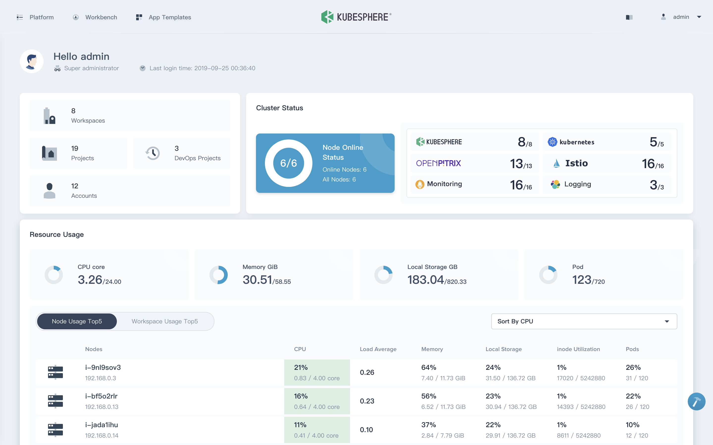
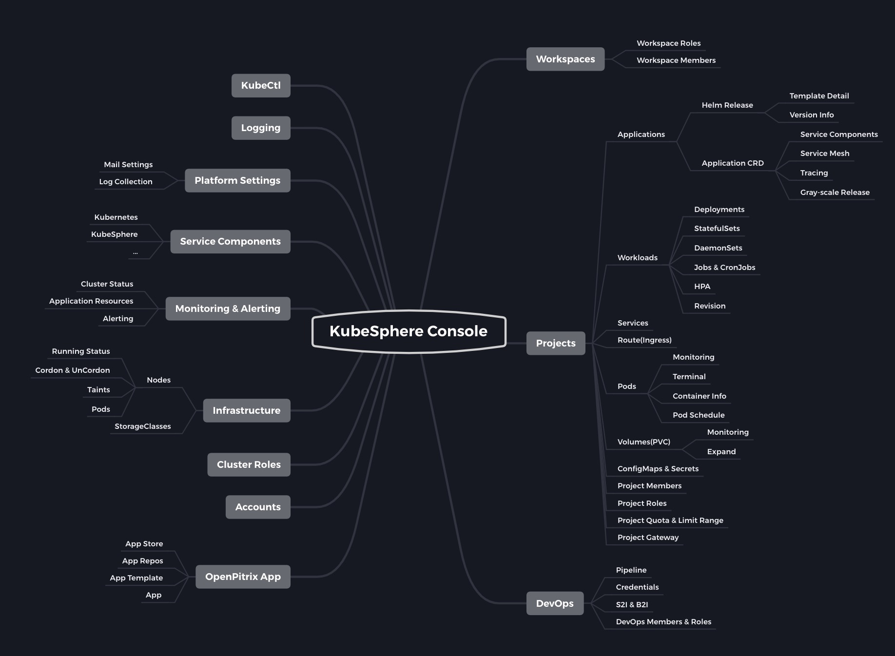

# Smartkube Console

Este repositorio es una copia del repo console de kubesphere (https://github.com/kubesphere/console/). El objetivo de esta copia es realizar el cambio de look & feel de la consola.

## Setup para levantar el entorno de dev

### Requisitos

Debes tener instalados los siguientes paquetes:

- docker
- docker-compose

### Conectando con un backend remoto

Para poder configurar la consola local para atacar contra un clúster backend necesitamos parchear en el clúster el ks-apiserver:

> En Smartkube el puerto a usar es el 30882. Para una instalación estándar de Kubesphere usaremos el 30881

```
kubectl -n kubesphere-system patch svc ks-apiserver -p '{"spec":{"type":"NodePort","ports":[{"name":"ks-apiserver","port":80,"protocal":"TCP","targetPort":9090,"nodePort":30882}]}}'
```

A continuación tenemos que poner la IP y puerto del ks-apiserver donde atacaremos en el fichero server/local_config.yaml:

```
server:
  apiServer:
    url: http://<IP_WORKER>:30882
    wsUrl: ws://<IP_WORKER>:30882
```

### Levantar entorno de desarrollo:

Hemos creado un script para levantarlo cómodamente:

```yaml
./start-dev.sh
```

Podremos acceder al entorno de dev en http://localhost:8000. Una vez levantada la consola podremos hacer cambios "en vivo", es decir, que simplemente guardando los ficheros que modifiquemos hará un reload automático (compilando lo necesario) y veremos los cambios realizados.

### Build del container para producción

Podemos hacer el build y el tag automático con este script:

> NOTA: Ten en cuenta que cuando hagas push machacarás la imagen actual

```yaml
./build-prod.sh
```

## Manual para sustituir estética Kubesphere a Smartkube

### Cambiar texto "Kubesphere" por "Smartkube"

```yaml
for i in $(grep -ri "kubesphere" . | cut -d ":" -f1 | sort -n | uniq | grep -v Dockerfile); do sed -i 's%Kubesphere%Smartkube%g' $i; done
for i in $(grep -ri "kubesphere" . | cut -d ":" -f1 | sort -n | uniq | grep -v Dockerfile); do sed -i 's%KubeSphere%Smartkube%g' $i; done
```

### Cambiar colores - Usamos el flag I al final del sed para que sea case-insensitive

```yaml
for i in $(grep -ri "#36435c" . | cut -d ":" -f1 | uniq | sort -n); do sed -i 's%#36435c%#65a428%gI' $i; done
```

Aquí tenemos un listado completo con los comandos para reemplazar los colores de forma masiva:

> WARN: Puede ser que alguno de los siguientes comandos no estén bien

```yaml
for i in $(grep -ri "#36435c" . | cut -d ":" -f1 | uniq | sort -n); do sed -i 's%#242E42%#335413%gI' $i; done
for i in $(grep -ri "#242E42" . | cut -d ":" -f1 | uniq | sort -n); do sed -i 's%#242e42%#335413%gI' $i; done
for i in $(grep -ri "#65A428" . | cut -d ":" -f1 | uniq | sort -n); do sed -i 's%#65A428%#3563ad%gI' $i; done
for i in $(grep -ri "#D8DA00" . | cut -d ":" -f1 | uniq | sort -n); do sed -i 's%#D8DA00%#F18918%gI' $i; done
for i in $(grep -ri "#65A428" . | cut -d ":" -f1 | uniq | sort -n); do sed -i 's%#65a428%#3563AD%gI' $i; done
for i in $(grep -ri "#335413" . | cut -d ":" -f1 | uniq | sort -n); do sed -i 's%#335413%#3563AD%gI' $i; done
for i in $(grep -ri "#55bc8a" . | cut -d ":" -f1 | uniq | sort -n); do sed -i 's%#55bc8a%#F18918%gI' $i; don
for i in $(grep -ri "#00aa72" . | cut -d ":" -f1 | uniq | sort -n); do sed -i 's%#00aa72%#C0690C%gI' $i; done
for i in $(grep -ri "#dbefe2" . | cut -d ":" -f1 | uniq | sort -n); do sed -i 's%#dbefe2%#90e0c5%gI' $i; done
for i in $(grep -ri "#90e0c5" . | cut -d ":" -f1 | uniq | sort -n); do sed -i 's%#90e0c5%#F9CE9F%gI' $i; done
# for i in $(grep -ri "#F9CE9F" . | cut -d ":" -f1 | uniq | sort -n); do sed -i 's%#F9CE9F%#FDF3E7%gI' $i; done
for i in $(grep -ri "#329dce" . | cut -d ":" -f1 | uniq | sort -n); do sed -i 's%#329dce%#F18918%gI' $i; done
for i in $(grep -ri "#324558" . | cut -d ":" -f1 | uniq | sort -n); do sed -i 's%#324558%#C0690C%gI' $i; done
for i in $(grep -ri "#b6c2cd" . | cut -d ":" -f1 | uniq | sort -n); do sed -i 's%#b6c2cd%#F9CE9F%gI' $i; done
```

### Cambiar ruta al logo

```yaml
for i in $(grep -ri "/assets/logo.svg" . | cut -d ":" -f1 | uniq | sort -n); do sed -i 's%/assets/logo.svg%/assets/smartkube_logo.svg%g' $i; done
sed -i 's%assets/login-logo.svg%assets/smartkube_logo.svg%g' src/components/Layout/Header/index.jsx
```

### Modificar color subtítulos (texto debajo de titles)

```yaml
sed -i 's%#79879c%#4f7ec9%gI' ./src/scss/variables.scss
```

### Modificar colores mayoría iconos

Los iconos heredan de la dependencia "lego", por lo que no hay ningún lugar en el código donde esté especificado.

Añadir nuevo bloque en: ./src/scss/lego.custom.scss

```yaml
.qicon-dark {
  color: #3563ad;
  fill: #8aa9db;
}
```

### Modificar tamaño logo en:

- Pantalla login: ./server/public/login.css -> Cambiar a 150px x 85px (clase .logo img) + cambiar top: 80px a top: 50px (clase .logo)
- Header: ./src/components/Layout/Header/index.scss -> Cambiar a 115px x 70px (clase .logo)
- Platform info: ./src/pages/settings/containers/BaseInfo/index.scss -> Cambiar a 150px x 85px
- About screen: ./src/components/Modals/About/index.scss -> Cambiar a 150px x 85px

## Referencia de colores

### Kubesphere colors

#### Iconos Dashboard principal

```yaml
color: #36435C;
```

#### Iconos settings (clusters management, access control, etc)

```yaml
color: #242E42;
```

#### Workspace texto menú izquierda

```yaml
color: #55bc8a;
```

#### Workspace iconos menú izquierda

```yaml
color: #00aa72; (verde oscuro)
fill: #90e0c5; (verde claro)
```

#### Pantalla overview (fondo icono derecha verde claro)

```yaml
color: #dbefe2;
```

#### Iconos pequeños svg

```yaml
color: #324558; (dark gray)
fill: #b6c2cd; (soft gray)
```

#### Menú flotante (click en platform)

NO SÉ EXACTAMENTE QUÉ ES ESTE VERDE: #369a6a

#### Menú flotante background selected (click en platform)

```yaml
color: #329dce;
```

### Smartkube colors

```yaml
color: #3563AD;  # Blau
fill: #F18918:  # Taronja
```

Colors secundaris:

```yaml
color: #1e3862;  # Blau fosc
color: #4f7ec9;  # Blau clar
color: #8aa9db;  # Blau més clar
```

#### Iconos settings (clusters management, access control, etc)

```yaml
color: #335413;
```

#### Workspace texto menú izquierda

```yaml
color: #F18918;
```

#### Workspace iconos menú izquierda

```yaml
color: #C0690C; (naranja oscuro)
fill: #F9CE9F; (naranja claro)
```

#### Pantalla overview (fondo icono derecha)

```yaml
color: #F9CE9F;
```

#### Menú flotante background selected (click en platform)

```yaml
color: #3563AD;
```

#### Iconos pequeños svg

```yaml
color: #C0690C; (dark gray)
fill: #F9CE9F; (soft gray)
```

### Geko Cloud colors (release 2.1)

#### Iconos dashboard principal

```yaml
color: #65A428;
fill: #D8DA00;
```

---

# ORIGINAL README

## Smartkube Console


[](https://www.gnu.org/licenses/agpl-3.0)

Smartkube Console is the web-based UI for [Smartkube](https://github.com/kubesphere/kubesphere) clusters.



## Getting Started

A Smartkube cluster is required before getting started.

Read [Installation](https://github.com/kubesphere/kubesphere#installation) guide to install a cluster.

Read [the guide](https://github.com/kubesphere/kubesphere#to-start-using-kubesphere) to start using Smartkube.

Features Map:



## Developer Guide

### Preparation

Make sure the following software is installed and added to the \$PATH variable:

- A Smartkube cluster ([Installation](https://github.com/kubesphere/kubesphere#installation))
- Node.js 8+ ([installation with nvm](https://github.com/creationix/nvm#usage))
- Yarn 1.19.1+

Install yarn with npm:

```sh
npm install -g yarn
```

Fork the repository, then clone your repository and install the dependencies:

```sh
yarn
```

Note: If you are in China Mainland, execute the following command before running the command above for faster installation.

```sh
yarn config set registry https://registry.npm.taobao.org
```

Alternatively you can start development using docker. See [Development with Docker](/docs/development-with-docker.md).

### Access the backend services of Smartkube

Follow [the guide](/docs/access-backend.md) to configure the backend services.

### Start Smartkube Console for development

```sh
yarn lego
yarn start
```

Now, you can access http://localhost:8000 to view the console using the default account admin / P@88w0rd.

### Run tests

```sh
yarn test
```

### Build Smartkube Console for production

The project can be built for production by using the following task:

```sh
yarn build
```

To build and serve from dist, using the following task:

```sh
yarn serve
```

To build Smartkube console to an image, run the following task after `yarn build`:

```sh
docker build -t ks-console .
```

Test Smartkube console image by run:

```sh
./docker-run
```

## Development Workflow

Follow [Development Workflow](/docs/development-workflow.md) to commit your codes.

## Support, Discussion, and Community

If you need any help with Smartkube, please join us at [Slack Channel](https://join.slack.com/t/kubesphere/shared_invite/enQtNTE3MDIxNzUxNzQ0LTZkNTdkYWNiYTVkMTM5ZThhODY1MjAyZmVlYWEwZmQ3ODQ1NmM1MGVkNWEzZTRhNzk0MzM5MmY4NDc3ZWVhMjE).

Please submit any Smartkube Console bugs, issues, and feature requests to [Smartkube Console GitHub Issue](https://github.com/kubesphere/console/issues).

## Contributing to the project

Welcome to contribute to Smartkube Console, see [Contributing Guide](docs/contributing-guide.md).
